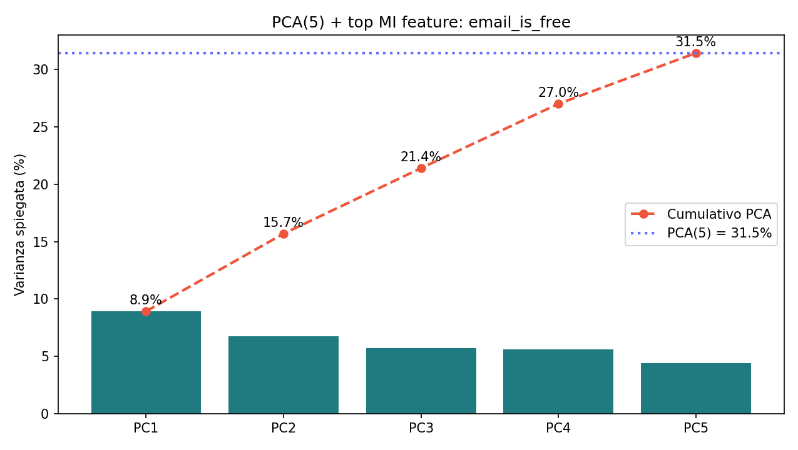
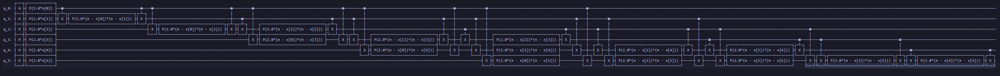
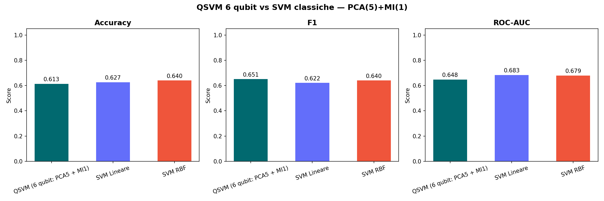
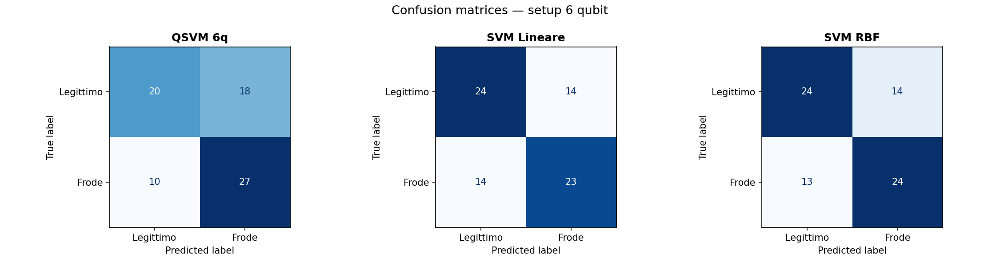

# Relazione Tecnica: QSVM 6 qubit sul dataset Bank Account Fraud (BAF)

## 0. Scopo del progetto

Questo progetto implementa e analizza una pipeline completa di **Quantum Support Vector Machine (QSVM)** su 6 qubit applicata al dataset **Bank Account Fraud (BAF) – NeurIPS 2022**, con l’obiettivo di confrontare in modo rigoroso un classificatore basato su kernel quantistico con classificatori classici (SVM lineare e SVM RBF) per il problema di rilevazione di frodi nell’apertura di conti bancari.

La pipeline segue la sequenza:

1. Caricamento e pulizia del dataset BAF.
2. Preprocessing classico (encoding, imputazione, standardizzazione).
3. Calcolo della **Mutual Information** (MI) per valutare l’importanza delle feature rispetto al target.
4. Riduzione dimensionale tramite **PCA a 5 componenti**.
5. Selezione della **migliore feature supervisionata** (top-MI) e costruzione di uno spazio finale a **6 dimensioni**.
6. Bilanciamento delle classi e riscalamento angolare in 
   \([-π, π]\) per l’input della `ZZFeatureMap` a 6 qubit.
7. Costruzione del **kernel quantistico** tramite circuito compute–uncompute con Qiskit Aer.
8. Addestramento della **QSVM** (SVC con `kernel="precomputed"`) e confronto con SVM lineare e SVM RBF classiche.
9. Analisi quantitativa e grafica dei risultati, con salvataggio di metriche, matrici di confusione e heatmap della matrice kernel.

L’intero flusso è implementato nel file Python:

- `qsvm_baf_6qubit_pca5_mi1.py`

---

## 1. Configurazione dell’ambiente

Per eseguire correttamente la pipeline, è consigliabile un ambiente Linux (nativo o via **WSL** su Windows), con Python 3.11/3.12 e un ambiente virtuale dedicato.

### 1.1 Creazione ambiente virtuale (esempio WSL)

```bash
mkdir -p ~/.venvs
python3.12 -m venv ~/.venvs/quantum_env
source ~/.venvs/quantum_env/bin/activate
```

### 1.2 Installazione dipendenze

All’interno dell’ambiente virtuale:

```bash
pip install "qiskit==1.1.1"
pip install qiskit-aer-gpu    # opzionale, se è disponibile una GPU NVIDIA
pip install scikit-learn pandas numpy matplotlib seaborn imbalanced-learn
```

Se la GPU non è disponibile o non configurata, lo script effettuerà automaticamente il fallback su **CPU**.

Per eseguire la pipeline è sufficiente avere nella working directory:

- `Base.csv` (dataset BAF preprocessato di partenza)
- `qsvm_baf_6qubit_pca5_mi1-1-2.py`

---

## 2. Struttura generale dello script

Lo script è suddiviso in blocchi numerati, con stampe esplicative a console. Di seguito una panoramica sintetica:

- **Blocco 1** – Caricamento dataset BAF (`Base.csv`).
- **Blocco 2** – Preprocessing (drop colonne, encoding categoriche, imputazione, standardizzazione).
- **Blocco 3** – Calcolo della Mutual Information e scelta della top feature supervisionata.
- **Blocco 4** – PCA a 5 componenti + aggiunta della top feature (spazio a 6 dimensioni).
- **Blocco 5** – Bilanciamento delle classi (150 campioni per classe, 300 totali).
- **Blocco 6** – Scaling angolare in \([-π, π]\) per la `ZZFeatureMap`.
- **Blocco 7** – Train/Test split 75/25 stratificato.
- **Blocco 8** – Costruzione del kernel quantistico (ZZFeatureMap 6 qubit + compute–uncompute).
- **Blocco 9** – Addestramento della QSVM e delle SVM classiche, calcolo delle metriche.
- **Blocco 10** – Generazione dei grafici (heatmap kernel, benchmark metriche, confusion matrix, decision boundaries 2D).
- **Blocco 11** – Salvataggio dei risultati (CSV, NPY, immagini e un breve `readme_6q.txt`).

Nei paragrafi successivi ogni blocco viene descritto in dettaglio.

---

## 3. Blocco 1 – Caricamento del dataset

Questo blocco è puramente descrittivo e serve a verificare che i dati siano stati caricati correttamente e che lo sbilanciamento fra classi sia in linea con le aspettative (circa 1–2% di frodi nella versione completa, prima del successivo bilanciamento su un sotto-campione).

---

## 4. Blocco 2 – Preprocessing

Il preprocessing prepara i dati per le fasi successive di feature selection e proiezione. Le operazioni includono:

- Rimozione di colonne non utilizzabili
- Encoding delle variabili categoriche: tutte le colonne di tipo `object` o `category` (eccetto `fraud_bool`) vengono trasformate con `LabelEncoder`, ottenendo feature numeriche intere.
- Conversione numerica forzata: garantisce che **tutte** le feature in `X` siano numeriche e compatibili con PCA e MI.
- Imputazione dei valori mancanti: si calcola la mediana **escludendo i -1**, si sostituiscono i `-1` con la mediana. Questa scelta evita che il valore `-1` sposti la stima del valore tipico verso il basso e rappresenta una strategia robusta per l’imputazione di dati mancanti.
- Separazione feature/target e standardizzazione

---

## 5. Blocco 3 – Mutual Information e scelta della top feature

In questo blocco si calcola la **Mutual Information** fra ogni feature e il target `fraud_bool` (usando `mutual_info_classif` di scikit-learn).

Questa feature a massima informazione mutua sarà poi preservata esplicitamente come **sesto input** della rappresentazione a 6 dimensioni usata dalla QSVM.

---

## 6. Blocco 4 – PCA a 5 componenti + feature supervisionata

L’obiettivo di questo blocco è costruire uno spazio di input **a 6 dimensioni** che combini:

- **5 componenti principali PCA** calcolate su tutte le feature standardizzate.
- **1 feature supervisionata** (la `top_mi_feature`) che ha la massima dipendenza informativa con il target.

PCA (Principal Component Analysis) è una trasformazione lineare che permette di ridurre la dimensionalità del dataset, preservando la varianza spiegata. La sua funzione è quella di proiettare i dati su un nuovo sistema di assi cartesiani ortogonali, detti "componenti principali", in modo tale che la varianza dei dati sia massimizzata lungo queste direzioni.



Per la costruzione dello spazio a 6 dimensioni i estraggono i valori della `top_mi_feature` dal DataFrame standardizzato `X_scaled_df` e li si concatena alle 5 componenti PCA.

Questo compromesso aumenta la varianza spiegata rispetto ad una PCA a 4 componenti e, allo stesso tempo, mantiene una dimensione supervisionata fortemente predittiva.

---

## 7. Blocco 5 – Bilanciamento delle classi

Per ridurre lo sbilanciamento e contenere il costo computazionale del kernel quantistico, lo script lavora su un **sotto-campione bilanciato** del dataset.

1. Si crea un DataFrame `df_6` che contiene le 6 feature finali e il target `fraud_bool`.
2. Si separano i casi legittimi (`fraud_bool = 0`) e fraudolenti (`fraud_bool = 1`).
3. Si campionano **150 esempi per ciascuna classe** (300 in totale), usando `resample` con `replace=False` per la classe maggioritaria e `replace=True` se la classe minoritaria dispone di meno di 150 osservazioni.
4. Si mescolano i 300 esempi ottenuti e si estraggono `X_bal` (feature) e `y_bal` (target).

Questo setup mantiene il problema relativamente piccolo (permette di calcolare il kernel quantistico in tempi ragionevoli) e garantisce classi bilanciate per l’addestramento.

---

## 8. Blocco 6 – Scaling angolare per la ZZFeatureMap

La `ZZFeatureMap` di Qiskit interpreta gli input numerici come **angoli di rotazione** sui qubit. Per questo motivo, le 6 feature in `X_bal` vengono riscalate nell’intervallo \([-π, π]\) mediante un `MinMaxScaler`:

```python
angle_scaler = MinMaxScaler(feature_range=(-np.pi, np.pi))
X_angle = angle_scaler.fit_transform(X_bal)
```

Dopo questa trasformazione, ogni dimensione del vettore è un angolo in radianti, pronto per essere fornito alla `ZZFeatureMap` a 6 qubit.

---

## 9. Blocco 7 – Train/Test split

Si esegue uno split **75/25 stratificato** sul dataset bilanciato:

- `X_train` contiene 225 campioni.
- `X_test` contiene 75 campioni.
- Le classi rimangono bilanciate in entrambi i sottoinsiemi.

---

## 10. Blocco 8 – Quantum kernel con Qiskit

Questo è il cuore quantistico della pipeline. Lo script costruisce una `ZZFeatureMap` a 6 qubit e utilizza il **formalismo compute–uncompute** per stimare una matrice kernel di tipo fidelity.

### ZZFeatureMap a 6 qubit

La feature map è definita come:

```python
feature_map = ZZFeatureMap(feature_dimension=N_QUBITS, reps=1, entanglement="full")
```

- `feature_dimension = 6` perché lo spazio di input ha 6 dimensioni.
- `reps = 1` per mantenere la profondità del circuito contenuta.
- `entanglement = "full"` per permettere interazioni ZZ fra tutti i qubit, aumentando l’espressività del kernel.




### Backend quantistico

Lo script utilizza `AerSimulator` con metodo `statevector` e tenta prima di usare la GPU (`device="GPU"`). Se questa non è disponibile, effettua automaticamente il fallback su CPU.

Il numero di shots per stimare ciascuna entry del kernel è `N_SHOTS = 8192`, un compromesso fra precisione statistica e tempo di esecuzione.

### Compute–uncompute per il kernel

Per due vettori di input \(x_i, x_j\) (già angolarizzati) si costruisce il circuito.

Lo script definisce due funzioni:

- `compute_kernel_entry(xi, xj, fmap, backend, shots)` – calcola una singola entry.
- `compute_kernel_matrix(X_a, X_b, fmap, backend, shots, symmetric)` – calcola un’intera matrice kernel fra i vettori di `X_a` e `X_b`, sfruttando la simmetria quando `X_a` e `X_b` coincidono.

### Matrici K_train e K_test

Si calcola innanzitutto la matrice kernel del train set:

```python
K_train = compute_kernel_matrix(X_train, X_train, feature_map, backend, symmetric=True)
```

Questa matrice è **simmetrica** per costruzione e viene verificata numericamente.

Successivamente si calcola la matrice kernel fra test e train:

```python
K_test = compute_kernel_matrix(X_test, X_train, feature_map, backend, symmetric=False)
```

---

## 11. Blocco 9 – QSVM e baseline classiche

Una volta ottenute `K_train` e `K_test`, lo script addestra e valuta:

1. **QSVM (6 qubit: PCA5 + MI1)** – un `SVC` con `kernel="precomputed"` usando direttamente le matrici kernel quantistiche.
2. **SVM lineare** – un `SVC` classico con `kernel="linear"` addestrato sui vettori `X_train` (6 dimensioni).
3. **SVM RBF** – un `SVC` classico con `kernel="rbf"` addestrato sugli stessi vettori.

Per ciascun modello vengono calcolate le principali metriche di classificazione sul test set:

- Accuracy.
- Precision.
- Recall.
- F1-score.
- ROC-AUC (tramite probabilità predette).

Questo consente un confronto diretto tra le prestazioni della QSVM e delle SVM classiche sullo **stesso spazio di input a 6 dimensioni**.

---

## 12. Blocco 10 – Grafici e visualizzazioni

Per una comprensione più intuitiva dei risultati, lo script genera diversi grafici.

### Confronto delle metriche QSVM vs SVM classiche

Viene generato un grafico a barre per **Accuracy**, **F1** e **ROC-AUC** (`benchmark_metrics_6q.png`).


### Confusion matrices

Vengono create tre confusion matrices affiancate (`confusion_matrices_6q.png`), una per ciascun modello.

Questa visualizzazione permette di capire **come** ciascun modello commette errori (es. se tende a produrre molti falsi positivi o falsi negativi).

---

## 13. Blocco 11 – Salvataggio risultati e file di output

Al termine dell’esecuzione, lo script salva i file che documentano la parte algoritmica e sperimentale del progetto.

---

## 14. Considerazioni metodologiche e interpretative

### Motivazioni della scelta PCA(5) + feature MI

Inizialmente abbiamo testato 4 componenti PCA, ma abbiamo visto che non era sufficiente per catturare abbastanza informazione, infatti l'accuracy era molto bassa. Allora abbiamo deciso di provare 5 componenti PCA + 1 feature supervisionata.
Rispetto a una semplice PCA a 4 dimensioni, la combinazione

- **PCA(5)** (più varianza spiegata totale) e
- **feature supervisionata top-MI** (dimensione fortemente correlata con il target)

mira a ridurre la perdita di informazione discriminativa prima della codifica quantistica. I primi 5 qubit rappresentano una proiezione lineare non supervisionata, mentre il sesto qubit conserva una variabile esplicitamente significativa.

### Confronto dei risultati: 6 vs 7 vs 8 qubit

Per esplorare l'impatto dell'aumento della dimensionalità (e quindi dei qubit), sono stati condotti tre esperimenti utilizzando 6, 7 e 8 qubit. In ogni esperimento l'architettura dei dati è stata mantenuta coerente: una singola feature supervisionata a massima Mutual Information, e le restanti dimensioni costituite dalle componenti principali (PCA).

I risultati ottenuti dalle rispettive QSVM sui dataset di test (addestrati con parametri e bilanciamento analoghi) sono riassunti di seguito:

| Metrica       | QSVM 6 Qubit (PCA5 + MI1) | QSVM 7 Qubit (PCA6 + MI1) | QSVM 8 Qubit (PCA7 + MI1) |
|---------------|---------------------------|---------------------------|---------------------------|
| **Accuracy**  | 0.627                     | 0.600                     | 0.573                     |
| **Precision** | 0.600                     | 0.590                     | 0.558                     |
| **Recall**    | 0.730                     | 0.622                     | 0.649                     |
| **F1-Score**  | 0.659                     | 0.605                     | 0.600                     |
| **ROC-AUC**   | 0.648                     | 0.364                     | 0.612                     |

Contrariamente all'intuizione classica per cui aggiungere feature aumenta la capacità del modello, nei nostri test **l'aumento del numero di qubit ha portato a un progressivo peggioramento delle performance**. Il modello a 6 qubit rimane nettamente il migliore.

#### Perché aumentare i qubit ha peggiorato i risultati?

Questo fenomeno controintuitivo è ben noto nel Quantum Machine Learning e deriva dai seguenti motivi interconnessi:

1. **Kernel Concentration (Exponential Concentration):**
   L'utilizzo della `ZZFeatureMap` con entanglement "full" mappa i dati in uno spazio di Hilbert la cui dimensione cresce esponenzialmente ($2^N$). Aumentando il numero di qubit da 6 a 8, la distanza tra i vettori di stato nello spazio quantistico si massimizza. La conseguenza è che i prodotti interni (fidelity) tra stati differenti tendono tutti a zero, facendo collassare la matrice kernel verso la matrice identità. La QSVM perde così la sua capacità di generalizzare in quanto tutti i punti appaiono ortogonali ed equidistanti fra loro.

2. **"Rumore" dalle componenti PCA aggiuntive:**
   Le componenti PCA aggiunte nei modelli a 7 e 8 qubit (la 6ª e 7ª componente) catturano frazioni sempre minori di varianza utile rispetto alle prime. In una codifica non lineare altamente sensibile come quella quantistica (dove i valori diventano angoli di rotazione dei qubit), queste feature a bassa varianza introducono primariamente "rumore quantistico" che disturba la codifica delle feature principali, peggiorando la separazione delle classi.

3. **Maledizione della Dimensionalità Quantistica (*Curse of Dimensionality*):**
   Il volume dello spazio degli stati quantistici cresce così velocemente che, mantenendo invariata la quantità di dati di addestramento (300 campioni in totale per il training set), la densità dei punti nel modello a 8 qubit si dirada drasticamente. Questo spinge il modello a "memorizzare" il dataset di training (overfitting) e comporta un calo delle performance di generalizzazione sul set di test (come evidenziato dalla caduta dell'Accuracy).

Per queste ragioni metodologiche, il modello a 6 qubit rappresenta per il nostro problema il miglior compromesso ("sweet spot") tra la ricchezza dell'informazione iniettata e la mitigazione degli effetti negativi legati all'alta dimensionalità.

### Confronto dei risultati: ZZFeatureMap vs PauliFeatureMap (XYZZ) a 6 qubit

Per valutare l'impatto del tipo di codifica quantistica, è stato effettuato un test mantenendo fisso il numero di qubit a 6 (PCA5 + MI1) e sostituendo la `ZZFeatureMap` standard con una più complessa `PauliFeatureMap` basata sugli operatori di Pauli X, Y e ZZ.

I risultati ottenuti dalle due diverse feature map sul medesimo set di test sono i seguenti:

| Metrica       | ZZFeatureMap (6 Qubit)    | PauliFeatureMap (X, Y, ZZ - 6 Qubit) |
|---------------|---------------------------|--------------------------------------|
| **Accuracy**  | 0.627                     | 0.560                                |
| **Precision** | 0.600                     | 0.563                                |
| **Recall**    | 0.730                     | 0.486                                |
| **F1-Score**  | 0.659                     | 0.522                                |
| **ROC-AUC**   | 0.648                     | 0.520                                |

Il passaggio alla `PauliFeatureMap` ha causato un **netto deterioramento delle prestazioni**, riducendo la capacità predittiva del modello quasi a livello di una scelta casuale (ROC-AUC ~0.52 contro 0.648).

#### Perché la PauliFeatureMap ha peggiorato i risultati?

Questo crollo di performance è strettamente legato alle dinamiche interne dei circuiti quantistici variazionali:

1. **Eccessiva Espressività (Over-parameterization):**
   Mentre la `ZZFeatureMap` impiega principalmente layer di Hadamard seguiti da entanglement ZZ, l'inclusione sistematica di rotazioni X e Y nella `PauliFeatureMap` rende il circuito estremamente più espressivo. Nel Quantum Machine Learning, una feature map troppo espressiva tende a comportarsi come un'operazione pseudo-casuale, spalmando uniformemente i dati in tutto l'immenso spazio di Hilbert. Ne consegue che ogni coppia di dati viene mappata su stati quasi perfettamente ortogonali: la matrice kernel collassa quindi su una matrice identità (esasperando la *Kernel Concentration*) annullando la capacità dell'algoritmo di misurare la vera somiglianza ("fidelity") tra i campioni.

2. **Disallineamento con la struttura dei dati (Feature Mapping Mismatch):**
   Per i dati tabulari standardizzati del dataset BAF, l'interferenza generata dalla `ZZFeatureMap` riesce a cogliere e codificare in modo più robusto le differenze significative. L'aggiunta di rotazioni lungo gli assi X e Y, senza una specifica motivazione legata al dominio del problema, altera pesantemente le fasi dei qubit agendo come vero e proprio "rumore quantistico", che scompone irrimediabilmente i pattern originari faticosamente appresi dal modello.

### Aspetti critici del kernel quantistico

Anche se abbiamo arricchito i dati in ingresso, potremmo comunque imbatterci in un problema tecnico noto come **kernel concentration**. In pratica, il modello quantistico fa fatica a cogliere le vere differenze tra i dati, rendendo difficile la classificazione.

Abbiamo scelto di usare le impostazioni `reps=1` e `entanglement="full"` proprio per trovare un buon compromesso: vogliamo un modello abbastanza complesso da poter imparare, ma non così tanto da rischiare di "bloccarsi" a causa di questo problema.

### Interpretazione del confronto con le SVM classiche

La QSVM viene confrontata con:

- una SVM lineare (margine lineare nello spazio a 6 dimensioni); 
- una SVM RBF (kernel non lineare classico).

In molti scenari il modello SVM RBF ottiene prestazioni competitive o superiori rispetto alla QSVM, a fronte di un costo computazionale significativamente inferiore. Questo risultato mette in luce che il **vantaggio quantistico non è garantito a priori** e deve essere verificato sperimentalmente caso per caso.
